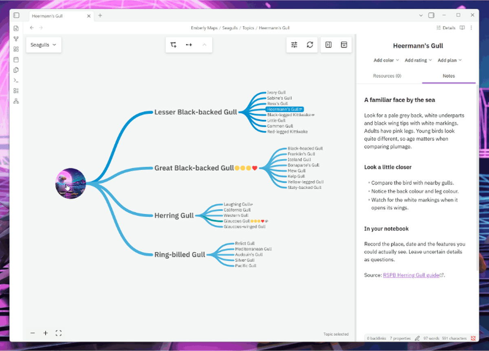
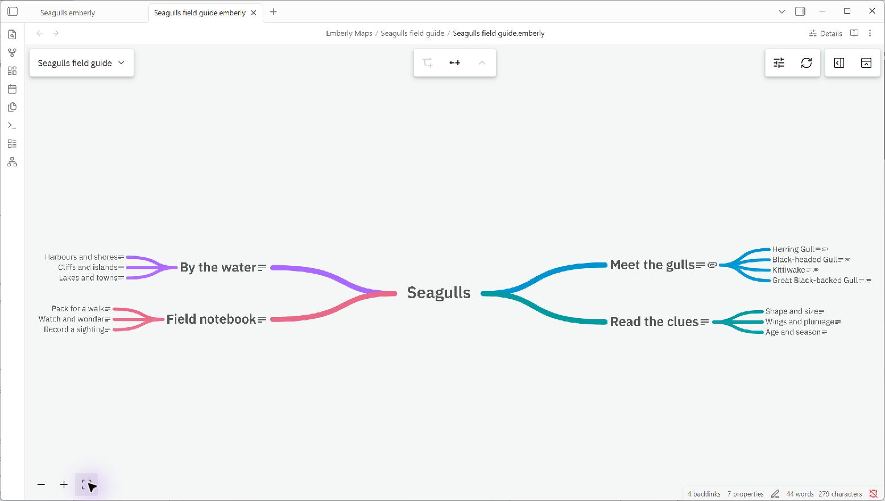
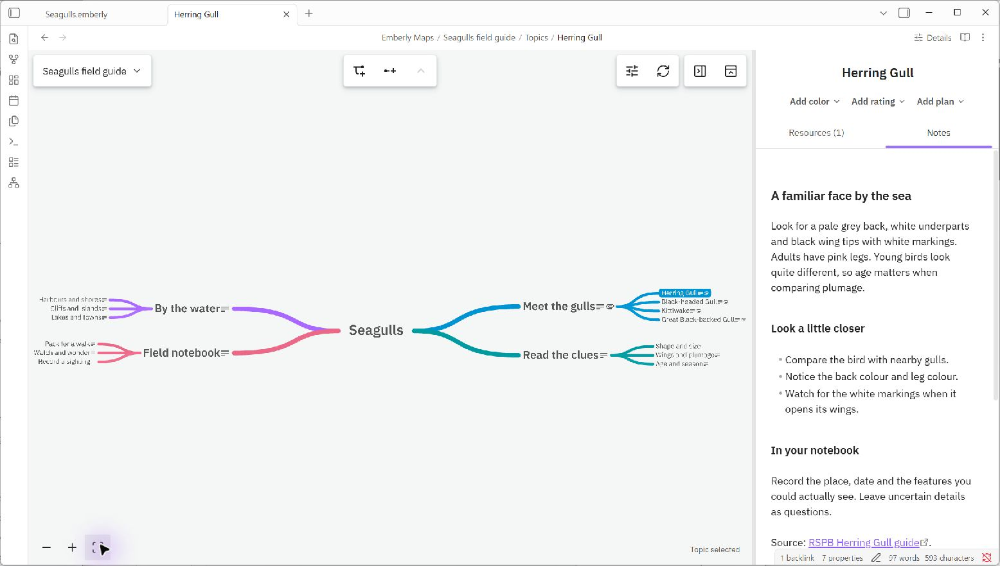

# Emberly Maps for Obsidian

This is the Obsidian plugin for [ember.ly](https://ember.ly), the squiggly mind map
note-taking tool. Since we're shutting Emberly down, we made this to give our
users somewhere to bring their maps.

We also spent a lot of time polishing the mind map engine, and it feels bad not
leaving it out there for others to use and take inspiration from.

Perhaps the Emberly mind map concept will have a more fitting life as an
Obsidian plugin.





## A little about the idea

We call it a knowledge tree: a map where each topic has a home for your notes,
bookmarks, and files. You can remember where things live, see how they fit
together, and let the branches grow as you learn.

No need to get the structure right the first time. Start with something you care
about. Move things around later.

More on the idea: [why Emberly works](https://blog.ember.ly/why-emberly-works/)
and [growing a knowledge tree](https://blog.ember.ly/how-to-get-started-with-a-knowledge-tree/).
These show the original app, but the idea is the same.



*Click a topic to open its notes and resources. This is our little
[Seagulls field guide test map](./tests/fixtures/seagulls/README.md), if you'd like to try it.*

## Bring your maps along

Copy the map folders from a fresh Emberly Markdown export into your Obsidian
vault, then choose **Emberly Maps: Open map…**. See the
[export guide](./docs/resource-export-v2.md) if you're bringing an older export.

Your notes and attachments stay in the vault as ordinary files, readable without
this plugin.

## Try it

You'll need **desktop Obsidian 1.13.7 or newer**. This is still an early release;
we're not in the Community plugins directory yet.

When a published build is available on the [releases page](https://github.com/GinaOfTheSea/emberly-obsidian-plugin/releases):

1. Download `main.js`, `manifest.json`, and `styles.css`.
2. Put them in `<your vault>/.obsidian/plugins/emberly-maps/`.
3. Reload Obsidian and enable **Emberly Maps** in **Settings → Community plugins**.
4. Choose **Emberly Maps: Open map…** or **Create map…** from the command palette.

For now, you'll need to open the map again after restarting Obsidian.
**Return to plain note** brings you back to the ordinary editor.

## Your notes stay yours

No account, paid features, ads, tracking, or donation prompts. The map works
offline, with fonts and assets bundled. Resource links open in your browser;
we don't fetch those pages. Obsidian handles embeds in your notes as usual.

## Help it grow

Ideas, bug reports, code, and docs are all welcome.
[Tell us about it](https://github.com/GinaOfTheSea/emberly-obsidian-plugin/issues).
For bugs, please include your Obsidian version and what happened.

To build it yourself, use the Node version in `.nvmrc`:

```sh
npm ci
npm run verify
```

Install the three files as above. More in the [development notes](./docs/development.md),
[folder guide](./docs/repository-structure.md), and [publishing guide](./docs/publishing.md).

## License

Copyright (C) 2026 Emberly AS. Free and open source under the
[GNU AGPL v3](./LICENSE). See [third-party notices](./THIRD_PARTY_NOTICES.md)
for component and asset licenses.
